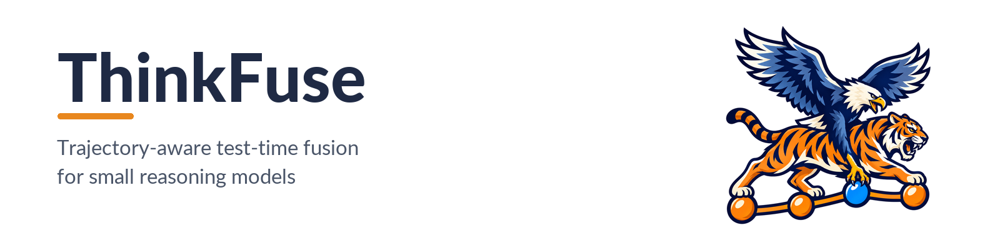
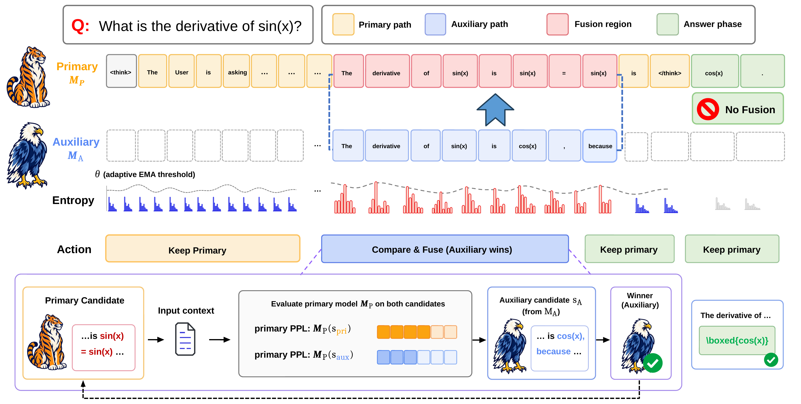
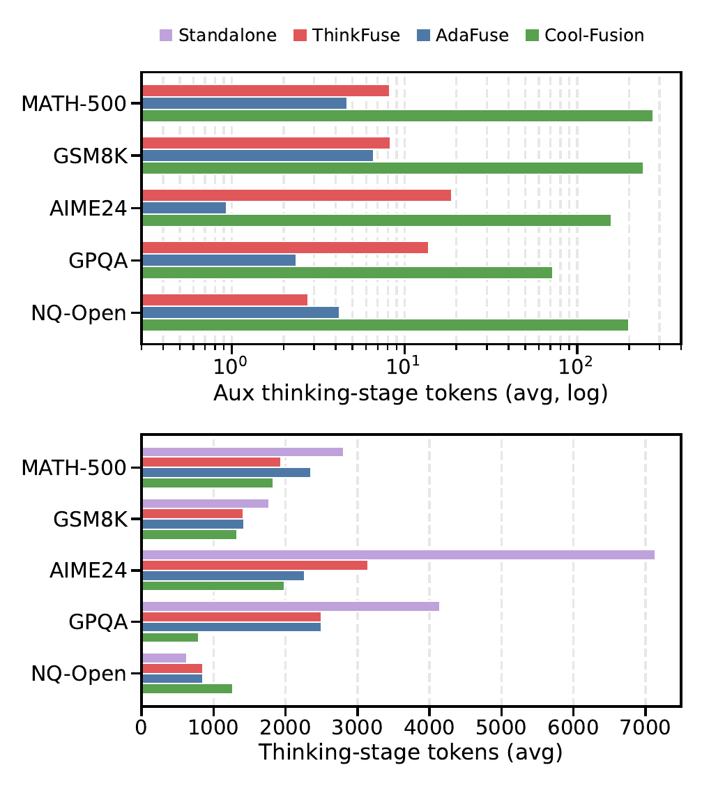

<p align="center">
  
</p>

<div align="center">

[](#citation)
[](https://js-lee-ai.github.io/ThinkFuse/)
[](LICENSE)
[](https://creativecommons.org/licenses/by/4.0/)
[](https://www.python.org/)
[](https://github.com/js-lee-AI/ThinkFuse/actions/workflows/ci.yml)
[](https://github.com/js-lee-AI/ThinkFuse/stargazers)

<b><a href="https://js-lee-ai.github.io/ThinkFuse/">Project Page</a> · <a href="#quick-start">Quick start</a> · <a href="#usage">Usage</a> · <a href="#default-hyperparameters">Hyperparameters</a> · <a href="#results">Results</a> · <a href="#faq">FAQ</a> · <a href="#citation">Citation</a></b>

</div>

---

## News

- **[2026-10-04]** Code released. The paper is accepted to Findings of EMNLP 2026.

## Overview

Small reasoning models solve hard problems by writing long chains of thought, but they rarely recover once the reasoning takes a wrong turn. Test-time fusion lets a second model step in. Existing fusion methods decide when to step in from local signals, so a brief fluctuation in uncertainty can trigger a fusion that overwrites a sound trajectory.

ThinkFuse is a training-free test-time fusion framework that intervenes only in unreliable reasoning segments. It rests on three parts.

* **Segment-level uncertainty.** Every `T` tokens, ThinkFuse reads the top-k log-probabilities of the primary model, turns each position into a normalized entropy, and aggregates the segment with Exponentially Weighted Causal Aggregation (EWCA), which weights later tokens more and carries the uncertainty accumulated by earlier ones.
* **Adaptive threshold with a soft budget.** The segment uncertainty is compared with a threshold built from an exponential moving average of the trajectory's own mean and deviation. The threshold rises quadratically with the cumulative fusion ratio, which keeps fusion sparse.
* **Trajectory compatibility scoring.** When the threshold is reached, the auxiliary model writes an alternative segment. The primary model scores both candidates by perplexity under the current context, and the lower one is appended. No reward model is used.

Monitoring and fusion run only while the model is thinking. Once `</think>` is written, the primary model finishes the answer alone.

With Qwen3-4B as the primary model and Ministral-3B-R as the auxiliary, ThinkFuse improves over standalone Qwen3-4B on all five benchmarks, by 20.0 points on AIME24 and 10.6 on GPQA. On the same pair, Cool-Fusion falls below the standalone model on all five benchmarks and AdaFuse on four.

## What it does in one picture

<p align="center">
  
</p>

<p align="center"><em>ThinkFuse monitors the segment-level uncertainty of the primary model M<sub>P</sub> with an adaptive threshold θ. When the uncertainty reaches the threshold, the auxiliary model M<sub>A</sub> writes an alternative segment, both candidates are scored by the perplexity of M<sub>P</sub>, and the more compatible one joins the context.</em></p>

## Quick start

```bash
pip install "git+https://github.com/js-lee-AI/ThinkFuse.git"
```

```python
import math
from thinkfuse import AdaptiveThreshold, UncertaintyCalculator

def segment(p_top, length=8, k=5):                  # 8 tokens, each with its top-5 log-probabilities
    rest = (1.0 - p_top) / (k - 1)
    return [{i: math.log(p) for i, p in enumerate([p_top] + [rest] * (k - 1))}] * length

calc, threshold = UncertaintyCalculator(), AdaptiveThreshold()
for name, p_top in [("confident", 0.90), ("uncertain", 0.30)]:
    u, _ = calc.compute(segment(p_top))             # EWCA over the normalized token entropies
    theta = threshold.get_threshold(fusion_ratio=0.0)
    print(f"{name:9s}  U {u:.2f}  theta {theta:.2f}  fuse {u >= theta}")
print(f"theta after fusing 10% of the segments  {threshold.get_threshold(fusion_ratio=0.1):.2f}")
# confident  U 0.29  theta 0.60  fuse False
# uncertain  U 0.98  theta 0.60  fuse True
# theta after fusing 10% of the segments  0.90
```

A segment whose tokens are confident stays under the threshold and the primary model continues alone. A segment with flat token distributions reaches it and triggers fusion. Each fusion raises the threshold for the segments that follow.

This runs on a CPU in well under a second and downloads nothing. The full loop with two mock models is [`example.py`](example.py), and CI runs it on every push.

```bash
git clone https://github.com/js-lee-AI/ThinkFuse.git && cd ThinkFuse
pip install -e ".[test]"
python example.py
```

| install | adds | enough for |
|---|---|---|
| `pip install "git+https://github.com/js-lee-AI/ThinkFuse.git"` | numpy | the whole library and the mock client |
| `git clone` and then `pip install -e ".[test]"` | pytest | `example.py` and `tests/` |

## Usage

### Run the fusion loop

```python
from thinkfuse import MockModelClient, ThinkFuse

primary = MockModelClient("qwen3-4b", script="<think> ... </think> answer")
auxiliary = MockModelClient("ministral-3b-reasoning")

engine = ThinkFuse(primary, auxiliary, preview_tokens=8)
result = engine.run("Question: ...\nAnswer:")

print(result.text)
print(result.total_segments, result.fused_segments, result.fusion_ratio)
```

`MockModelClient` is deterministic and needs no model weights, so the loop can be read and tested on a laptop. `total_segments` counts the segments monitored during the thinking phase, and `fused_segments` the ones where the auxiliary model was called.

### Connect your own models

Implement `ModelClient` for your backend. The engine needs token-level generation with top-k log-probabilities and a perplexity call.

```python
from thinkfuse import ModelClient

class MyClient(ModelClient):
    name = "qwen3-4b"
    def encode(self, text): ...
    def decode(self, ids, skip_special=True): ...
    def batch_decode(self, id_lists): ...
    def generate(self, context_ids, n_tokens, top_k): ...   # -> (new_ids, eos, token_logprobs)
    def perplexity(self, context_ids, segment_text): ...     # -> float
```

A typical implementation wraps a vLLM or Transformers server. `generate` requests `n_tokens` with `logprobs=top_k` and returns one dictionary of log-probabilities for each new token. `perplexity` scores a candidate continuation against the current context.

### API at a glance

| call | what it does |
|---|---|
| `ThinkFuse(primary, auxiliary, ...).run(prompt)` | the segment loop, returning `FusionResult(text, total_segments, fused_segments, fusion_ratio)` |
| `UncertaintyCalculator(...).compute(segment_logprobs)` | segment uncertainty by EWCA and the token uncertainties behind it |
| `AdaptiveThreshold(...).get_threshold(fusion_ratio)` | the threshold from the running mean, deviation and fusion ratio |
| `AdaptiveThreshold.should_fuse(u, fusion_ratio)`, `.update(u)` | the trigger, and the moving-average update after each segment |
| `SoftFusionBudget()` | the cumulative fusion ratio |
| `select_aligned_prefix(base, others, new_token_ids, mode)` | the prefix of a segment that decodes identically under both tokenizers |
| `select_by_primary_ppl(client, context_ids, candidates)` | the candidate with the lowest primary-model perplexity |
| `normalize_think_tags`, `adapt_think_tags_for_model`, `PhaseDetector` | reasoning-tag normalization and the thinking or answer phase |
| `ModelClient`, `MockModelClient` | the backend interface and an offline mock |

Everything imports with NumPy alone.

## Default hyperparameters

The defaults of `ThinkFuse(...)` are the settings of the paper.

| Parameter | Symbol | Argument | Value |
|---|---|---|---|
| Segment length | T | `preview_tokens` | 8 |
| Top-k log-probabilities | r | `top_k` | 5 |
| EWCA position weight | α | `ewca_alpha` | 0.1 |
| EWCA accumulation | β | `ewca_beta` | 0.5 |
| Moving-average rate | η | `ema_eta` | 0.05 |
| Deviation margin | τ | `tau` | 1.0 |
| Soft-budget coefficient | λ | `budget_lambda` | 50 |
| Initial mean | μ<sub>0</sub> | `init_mu` | 0.5 |
| Initial deviation | σ<sub>0</sub> | `init_sigma` | 0.1 |
| Uncertainty signal | | `uncertainty_method` | `"entropy"` |

Fusion is triggered when U<sub>k</sub> ≥ θ<sub>k</sub>, with θ<sub>k</sub> = (μ<sub>k−1</sub> + τ σ<sub>k−1</sub>)(1 + λ R<sub>k−1</sub><sup>2</sup>) and R the share of monitored segments that were fused so far.

## Results

Cool-Fusion fuses the most auxiliary tokens on every benchmark and ends with the shortest thinking stage on four of the five. ThinkFuse fuses far fewer auxiliary tokens, and on AIME24 it keeps the longest thinking stage of the three fusion methods.

<p align="center">
  
</p>

<p align="center"><em>Figure 2 of the paper. Top, average fused auxiliary tokens in log scale. Bottom, average thinking-stage tokens. All fusion configurations use Qwen3-4B as the primary model and Ministral-3B-R as the auxiliary model.</em></p>

### Main results (paper Table 2)

Accuracy (%) under a 16K-token budget. Parentheses give the difference from the standalone primary model in percentage points.

| Method | MATH-500 | GSM8K | AIME24 | GPQA | NQ-Open |
|---|---|---|---|---|---|
| *Standalone models* | | | | | |
| Qwen3-4B | 89.0 | 92.0 | 53.3 | 54.0 | 29.5 |
| Qwen3-1.7B‡ | 83.0 | 90.0 | 33.3 | 39.4 | 28.0 |
| Ministral-3B-R | 32.5 | 67.0 | 0.0† | 25.8 | 24.0 |
| EXAONE-4.0-1.2B | 57.0 | 85.0 | 3.3† | 38.9 | 22.0 |
| *Test-time compute baseline, Qwen3-4B* | | | | | |
| Self-consistency (K=3) | 89.5 (+0.5) | 94.5 (+2.5) | 53.3 (+0.0) | 51.0 (−3.0) | 39.0 (+9.5) |
| Self-consistency (K=5) | 88.0 (−1.0) | 94.5 (+2.5) | 53.3 (+0.0) | 50.0 (−4.0) | 39.0 (+9.5) |
| *Test-time fusion baselines, Qwen3-4B × Ministral-3B-R* | | | | | |
| Cool-Fusion | 31.0 (−58.0) | 66.0 (−26.0) | 0.0† (−53.3) | 11.6 (−42.4) | 0.5 (−29.0) |
| AdaFuse | 45.5 (−43.5) | 72.6 (−19.4) | 33.3 (−20.0) | 28.8 (−25.2) | 38.5 (+9.0) |
| *ThinkFuse* | | | | | |
| Qwen3-4B × Ministral-3B-R | 90.0 (+1.0) | **96.9** (+4.9) | **73.3** (+20.0) | **64.6** (+10.6) | **39.5** (+10.0) |
| Qwen3-4B × Qwen3-1.7B | **91.0** (+2.0) | 94.0 (+2.0) | 70.0 (+16.7) | 55.1 (+1.1) | 37.0 (+7.5) |
| Qwen3-4B × Qwen3-4B | 75.0 (−14.0) | 90.0 (−2.0) | 40.0 (−13.3) | 28.3 (−25.7) | 38.0 (+8.5) |
| Qwen3-1.7B × EXAONE-4.0-1.2B | 85.0 (+2.0) | 90.5 (+0.5) | 30.0 (−3.3) | 53.5 (+14.1) | 28.0 (+0.0) |

† AIME24 results affected by length-limit or final-answer truncation. ‡ Standalone Qwen3-1.7B is evaluated with the Qwen3 recommended top-k of 20, and all other rows share one decoding setting.

### Additional model pairs (paper Table 9)

| Method | MATH-500 | GSM8K | AIME24 | GPQA | NQ-Open |
|---|---|---|---|---|---|
| Qwen3-4B | 89.0 | 92.0 | 53.3 | 54.0 | 29.5 |
| EXAONE-Deep-2.4B | 83.5 | 90.5 | 43.3 | 57.1 | 17.5 |
| DeepSeek-R1-Distill-Qwen-1.5B | 13.0 | 30.5 | 0.0† | 21.2 | 14.5 |
| ThinkFuse, Qwen3-4B × EXAONE-Deep-2.4B | **91.0** (+2.0) | **99.0** (+7.0) | **73.3** (+20.0) | 55.1 (+1.1) | **38.5** (+9.0) |
| ThinkFuse, Qwen3-4B × DeepSeek-R1-Distill-Qwen-1.5B | 90.5 (+1.5) | 95.0 (+3.0) | 56.7 (+3.4) | **63.3** (+9.3) | 37.7 (+8.2) |

### Compute efficiency (paper Table 3)

Qwen3-4B × Ministral-3B-R. Wall-clock time and TFLOPs are averages over examples, and accuracy is the average of the five benchmarks.

| Method | Wall-clock (s) | TFLOPs | Accuracy | Accuracy / TFLOPs |
|---|---|---|---|---|
| Cool-Fusion | 39.4 | 86 | 21.8 | 0.25 |
| AdaFuse | **33.9** | **74** | 43.7 | 0.60 |
| ThinkFuse | 68.7 | 77 | **72.9** | **0.95** |

ThinkFuse takes longer in wall-clock time at a comparable TFLOP count. The paper attributes the gap to data transfer between CPU and GPU during perplexity scoring.

See the paper for the instruction-tuned auxiliary models, the ablations, the significance tests and the qualitative example.

## Repository layout

```
thinkfuse/uncertainty.py    token entropy or confidence gap, and EWCA segment aggregation
thinkfuse/threshold.py      moving-average adaptive threshold with the soft fusion budget
thinkfuse/tags.py           reasoning-tag normalization and thinking or answer phase detection
thinkfuse/alignment.py      shared-prefix segment alignment across tokenizers
thinkfuse/scoring.py        primary-model perplexity selection
thinkfuse/fusion.py         the ThinkFuse engine with the full segment loop
thinkfuse/model_client.py   the model-client interface and an offline mock
example.py                  the full loop on two mock models, no GPU and no network
tests/                      CPU tests that CI runs
```

## FAQ

<details>
<summary><b>Do I need a GPU?</b></summary>

No for the library, the quick start, `example.py` and the tests, which need NumPy only. Running ThinkFuse on real models needs a backend that serves the two models, which you connect through `ModelClient`.

</details>

<details>
<summary><b>Which models does the paper use?</b></summary>

Six open-weight reasoning models from 1.2B to 4B parameters: Qwen3-4B, Qwen3-1.7B, DeepSeek-R1-Distill-Qwen-1.5B, Ministral-3B-R, EXAONE-Deep-2.4B and EXAONE-4.0-1.2B. Each pair is served with vLLM on two NVIDIA A100-80GB GPUs. Any pair of causal language models that return top-k log-probabilities should work.

</details>

<details>
<summary><b>Does the repository rebuild the paper's tables?</b></summary>

No. It holds the method: the uncertainty signal, the adaptive threshold, the alignment, the perplexity selection and the segment loop. The benchmark runners, the scorers and the Cool-Fusion and AdaFuse baselines are not included.

</details>

<details>
<summary><b>How are segments from two tokenizers compared?</b></summary>

The two models tokenize differently, so a segment of `T` tokens from one may not end on a token boundary of the other. `select_aligned_prefix` keeps the longest prefix that decodes to the same text under both tokenizers. Reasoning tags are normalized to `<think>` for fusion and restored to the format of the scoring model, since EXAONE-Deep writes `<thought>`.

</details>

<details>
<summary><b>Why does fusion stop after the thinking phase?</b></summary>

The method targets the reasoning trajectory. Once the primary model has closed its reasoning with `</think>`, it writes the final answer alone and no segment is monitored.

</details>

<details>
<summary><b>How many examples are behind each number?</b></summary>

A fixed random subsample of 200 examples for each benchmark, drawn once with seed 42 and shared by all methods, model pairs and ablations. AIME 2024 has 30 problems and GPQA-Diamond 198, so both are evaluated in full.

</details>

## Citation

If you use this code, please cite the paper.

```bibtex
@inproceedings{kang2026thinkfuse,
  title     = {ThinkFuse: Trajectory-Aware Test-Time Fusion for Small Reasoning Models},
  author    = {Kang, Myunghoon and Lee, Jungseob and Seo, Jaehyung and Lim, Heuiseok},
  booktitle = {Findings of the Association for Computational Linguistics: EMNLP 2026},
  year      = {2026}
}
```

Myunghoon Kang and Jungseob Lee contributed equally.

The Cite this repository button in the GitHub sidebar gives the same entry from [`CITATION.cff`](CITATION.cff).

## License

Code is MIT, see [LICENSE](LICENSE). The paper is CC BY 4.0.

## Acknowledgments

The benchmarks are [MATH-500](https://huggingface.co/datasets/HuggingFaceH4/MATH-500), [GSM8K](https://huggingface.co/datasets/openai/gsm8k), [AIME 2024](https://huggingface.co/datasets/Maxwell-Jia/AIME_2024), [GPQA-Diamond](https://github.com/idavidrein/gpqa) and [NQ-Open](https://huggingface.co/datasets/google-research-datasets/nq_open). The experiments run on [vLLM](https://github.com/vllm-project/vllm), with scoring from the [LM Evaluation Harness](https://github.com/EleutherAI/lm-evaluation-harness) and [Qwen2.5-Math](https://github.com/QwenLM/Qwen2.5-Math).
